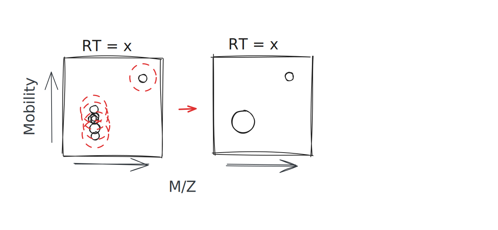
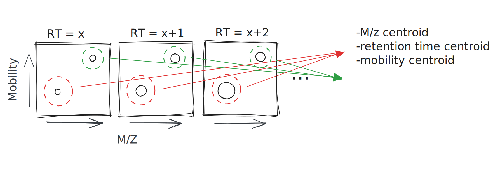

# IonMesh

## General functioning




In the simplest of forms this tool uses a variant of DBSCAN to
cluster peaks. Initially in the mz-ims dimensions along each frame.
Then in the mz-rt dimensions across the frames. Finally in the rt-ims
dimensions across the frames.

Then these clusters are used to generate pseudo-spectra. These pseudo-spectra are searched with Sage internally.

## Usage

```
cargo build --release
./target/release/ionmesh --help

RUST_LOG=info ./target/release/ionmesh ...
```

### Config

Its a toml file ...

```
[denoise_config]
mz_scaling = 0.015
ims_scaling = 0.03
ms2_min_n = 2
ms1_min_n = 3
ms1_min_cluster_intensity = 100
ms2_min_cluster_intensity = 50

[tracing_config]
mz_scaling = 0.019999999552965164
rt_scaling = 2.200000047683716
ims_scaling = 0.02
min_n = 2
min_neighbor_intensity = 200

[pseudoscan_generation_config]
rt_scaling = 0.7
quad_scaling = 5.0
ims_scaling = 0.02
min_n = 4
min_neighbor_intensity = 500

[sage_search_config]
static_mods = [[
    "C",
    57.0215,
]]
variable_mods = [[
    "M",
    [15.9949],
]]
fasta_path = "./tmp/UP000005640_9606.fasta"

[output_config] # These options can be missing, if missing will not output the files.
out_features_csv = "features.csv"
debug_traces_csv = "debug_traces.csv"
debug_scans_json = "debug_scans.json"

```

## Dev Usage

There are a couple of features for development.

### Env variables
```
RUST_LOG=info # will change the log level ... levels are standard (info, debug, warn, error, trace)
DEBUG_TRACES_FROM_CACHE=1 # If set and non empty will load the traces from the cache.
# It will skip the generation of the traces and will read the file specified on the config. (handy when optimizing the pseudospectra generation)
```

## Roadmap

1. Use aggregation metrics to re-score sage search.
2. [In progress] Do a two pass speudospec generation, where the first pass finds the centroids and the second pass aggregates around a radius. (this will prevent the issue where common ions, like b2's are assigned only to the most intense spectrum in a window....)
  - RN I believe it is over-aggregating peaks and leading to a lot of straggler peaks.
3. Re-define rt parmeters in the config as a function of the cycle time and not raw seconds.
4. Add targeted extraction.
5. Add detection of MS1 features + notched search instead of wide window search.
6. Clean up some of the features and decide what aggregation steps use interal paralellism. (in some steps making multiple aggregations in paralle is better than doing parallel operations within the aggregation).
  - Fix nomenclature ... I dont like how it is not consistent (indexed, indexer, index are using interchangeably ...).
7. Compilation warning cleanup.
8. Clean up dead/commented out code.
9. Refactor `max_extension_distances` argument in the generic dbscan implementation to prevent the errors that might arise from mixing up the dimensions.
    - Should that be a propoerty of the converter?
10. Commit to f32/f64 in specific places ... instead of the harder to maintain generic types.

## Maybe in the roadmap

1. Change pseudo-spectrum aggregation
  - I am happy with the trace aggregation (It can maybe be generalized to handle synchro or midia).


## Where are we at?

- Ids are pretty close to the equivalent DDA runs with the correct parameters ... They do seem good via manual inspection but the number of ids is low compared to peptide-centric searches.
